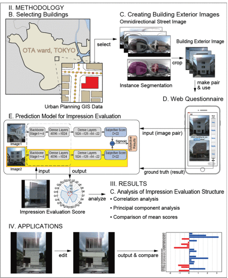
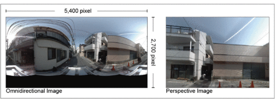
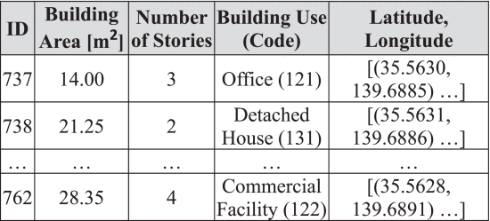
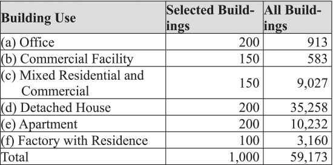
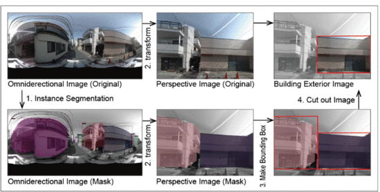
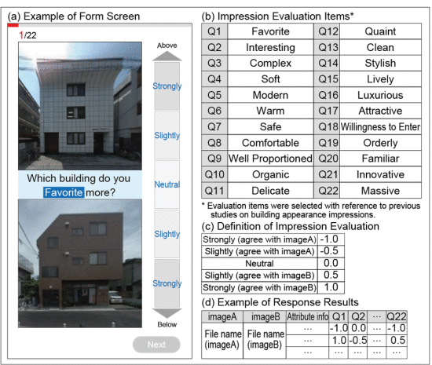
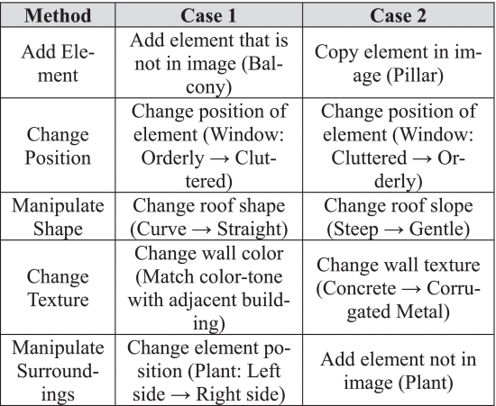

# Predicting Impression Evaluation of Building Exterior Appearance Using Street Image Big Data and Deep Learning

**Link:** <https://ieeexplore.ieee.org/document/10386316>

**Conference:** IEEE Big Data 23

**Keywords:** Building Exterior Appearance, Street Image, Deep Learning

## Summary
This paper proposes a method for predicting the impression evaluation of buildings’ exterior appearance using street image big data.

Research Question 1: Can the establishment of a method to create building exterior images linked to GIS data, including building location, shooting points, and attribute information, enable more detailed analyses in building exterior research using big image data? (GIS-based detailed analysis with image analysis)

Research Question 2: Previous studies have often analyzed impression evaluations for a single or a few attributes. However, when observing building exteriors, impressions are not necessarily singular but could be determined by interactions among multiple impressions. What kind of evaluative structure exists, and how are these impressions related to each other? (Correlations of different charactistics)

Research Question 3: While previous experiments have frequently compared images captured with the same composition or with limited building uses, differences in viewpoint angles or building uses might lead to different results even with the same experiment. In other words, could differences in building uses and viewpoint angles have some influence on the impression evaluations of building exteriors? (viewpoint angles and building uses' influence to impression evaluations)

Research Question 4: The predictive accuracy of models constructed in previous studies is good for test data, but the generalizability when inputting images beyond the training data remains unknown. Particularly, for models predicting subjective items, assessing the usefulness of the model is challenging. To what extent can the model constructed be applied to architectural design, especially considering its utility for subjective items? (generalizability)

## Methodology

1. Data Collection

Omnidirectional Street Image: 360-degree street view images provided by a company

GIS Data: provided by the government

2. Building Selection
Buildings that fit entirely within the omnidirectional street image.

1000 buildings limited to 6 major uses.

3. Creating Building Exterior Images

Mask R-CNN for segmentation, then maunally extract

4. Web  Questionaire

10,000 pairs from the 1000 buildings. 16,722 participants. Each participant rate from 1-5 for 22 items.

5. Prediction Model for Impression Evaluation

Siamese CNN. Input 2 images and predict the scores for 22 items.

## Emprical Study

