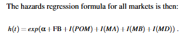
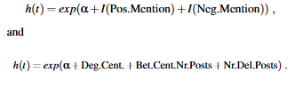
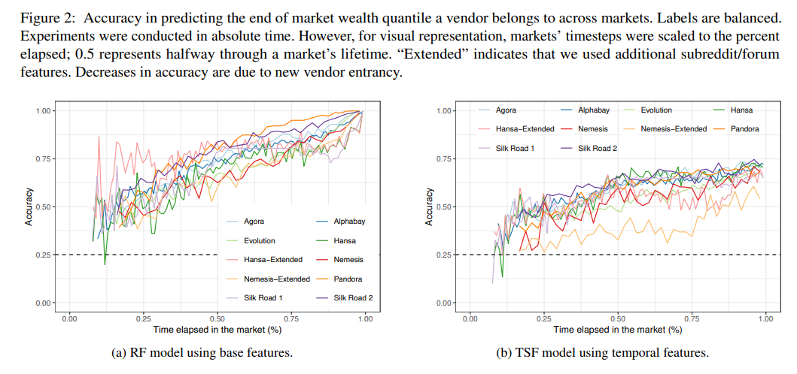
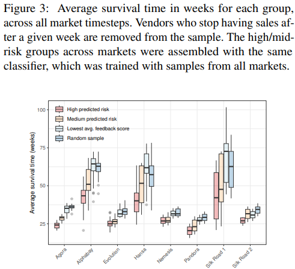

# Does Online Anonymous Market Vendor Reputation Matter?

**Link:** [https://www.usenix.org/conference/usenixsecurity24/presentation/cuevas](https://www.usenix.org/conference/usenixsecurity24/presentation/cuevas)

**Conference:** Usenix Security 2024
**Keywords:** : online anonymous marketplace (OAM), social media

### Summary
Reputation is crucial for trust in underground markets but it lacks credit system for measuring their reputation. This work use  **(i) longevity** and **(ii) future financial success** to measure their success on **8** OAM from 2011 to 2023. The findings provide empirical insights into early identification of potential high-scale vendors, effectiveness of "reputation poisoning" strategies, and how reputation systems could contribute to harm reduction in OAMs. 

### Contributions
1. We **quantify the impact of various market and forum-derived features** on vendor longevity and find that feedback scores (including imported product reviews from other markets) have a significant impact on increasing longevity across most markets we study;
2. We find that (both positive and negative) **reputation signals** from forums explain vendor survivability, but overall have little predictive power for vendor success;
3. We demonstrate we can build a **generalizable model to predict**, more accurately than raw feedback, which vendors may leave the market in the short-term (1–3 months);
4. We find that future financial success is **predictable**, particularly for the top/bottom 25% of vendors, and even on previously unseen markets.
5. We find that **features external to the market, and time-series representations of features** not only fail to increase the predictive power, but instead often **decrease** it.

### Data
1. Merketplace: Opensource data + crawler
2. Reddit:  /r/HansaDarknet-Market (Sep 2015 - Sep 2017, 264 posts, 3613 comments), /r/DarkNetMarkets (125,300 posts, 1,850,533 comments, October 2013 - September 2017)
3. Nemesis Forum (reddit-like Nemesis darknet forum): 4,018 posts and 12,710 comments from March 2022 to February 2023

### Feature
1. Revenue, feedback, and listing
2. Temporal features
3. Forum features
4. Listing category

### Survivability Drivers
Average feedback value (FB)
Presence in other markets (POM)
Category A drugs (MA), category B drugs (MB), and digital goods (MD).
Wealth tier

#### Results
1. Reputation and cross-market make vendor more survivable
2. Even a little bit **Reputation Slander Attack** could work (with calculating a case cost, *'It would take 254 1-star reviews for a total cost of ∼ $2, 286 to reduce their average rating by 1 unit and thus increase their (predicted) hazard by 64%'*)

### Future Financial Success Prediction
Random Forest, Time Series Forest classifier

### Vendor Disapperance Prediction
Random Forest, Time Series Forest classifier

### Conclusion
Correlation between reputation and OAM

### Pros:
1. Crossplatform
2. Interesting perspective (especially the reputation poisoning with fake bad reviews) 