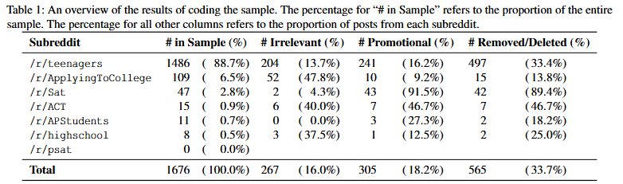

# “It was honestly just gambling”: Investigating the Experiences of Teenage Cryptocurrency Users on Reddit

**Link:** [https://www.usenix.org/conference/soups2024/presentation/bouma-sims](https://www.usenix.org/conference/soups2024/presentation/bouma-sims)

**Conference:** SOUPS 2024
**Keywords:** : usable security, cryptocurrency, teenagers, social media analysis

### Summary

Using keywords to identify cryptocurrency users' posts on reddit, this paper tackles 3 RQs:

1. **How** do teenage users gain access to the crypto asset ecosystem?
2. **What motivates** teenagers to engage with crypto assets?
3. **What types of harm** do teenagers experience when using crypto assets?

### Data
**48** mannually selected crypto-related keywords to filter posts from  **6** teenage-oriented subreddits (e.g., /r/Teenagers、/r/ApplyingToCollege) between Jun 2005 to Dec 2022. (post quantity: 6,408 -> 4,979 (delete some keywords) -> 1,676 (randomly sample) with comments)

### Methodology
Qualitative analysis for each post and show the statistics of each characteristic.

### Results
1. **How**: Creating accounts in the name of their parents or another
trusted adult
2. **Motivation**: large short-term profits
3. **Harm**: harms, including fraud victimization, wallet loss, and financial losses from poor investments

### Pros:
Vulunerable group with potential harm: Teen and cryptocurrency