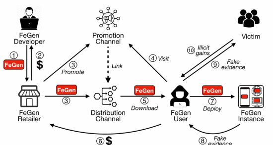
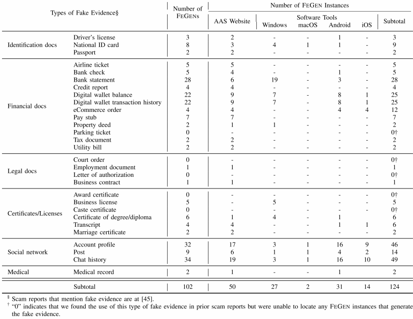

# Seeing is Not Always Believing: An Empirical Analysis of Fake Evidence Generators

**Link:** <https://ieeexplore.ieee.org/document/10628523>

**Conference:** EuroS&P 2024

**Keywords:** Fake Evidence, Deepfake, Image Forensics

## Summary
Build detector and conduct a empirical study on the ecosystem of fake evidence generators (FEGENs).

## Threat Model
FEGEN

## Data
1. Review public reports to get categories of potential FEGENs

2. Search on google, facebook, and tiktok. Get 148 instances with 72 AAS websites, and 76 software tools, corresponding to the 125 potential FEGENs

## Qualitative + Quantitative Analysis + Case study

(Note: Telegram search: SuperIndex News, Telegram Channels, TGStat)