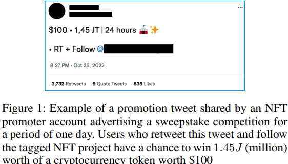

# Unveiling the Risks of NFT Promotion Scams

**Link:** [Unveiling the Risks of NFT Promotion Scams](Unveiling the Risks of NFT Promotion Scams)

**Conference:** ICWSM 2024
**Keywords:** : NFT, scam, social media, blockchain

### Summary
 Non-fungible tokens (NFTs)'s success highly depends on its online virality. Therefore, creators promotes their NFTs on social media platforms using dedicated promotion services. However, scammers freeload these services to steal users’ cryptocurrency asset. By conducting a longitudinal study of 439 promotion services (accounts) on Twitter that have collectively promoted 823 unique NFT projects through giveaway competitions over a period of two months, this paper builds machine learning classifier to detect NFT promotion scams and successfully identifies 382 fraudulent NFT projects.

### Research Questions
1. What are the characteristics and visibility of fraudulent NFT accounts that run promotions on Twitter?
2. How effective are prevalent anti-scam measures towards detecting these attacks?
3. What is the financial impact of these scams?

### Methodology 
1. Promotional Tweets: sweepstake competitions by retweeting, following, and tagging friends. Draw a hype that the product is very popular.
 

2. Data Collection: 439 accounts with 21.6k promotion tweets. Using regex extracting 2,831 NFT promotion tweets for 823 unique NFT projects.

3. Fradulent Identification: 2 characteristics for labeling an NFT collection as fraudulent: i) Accounts that imitate a popular NFT collection and share a fake NFT minting phishing link with the sole goal of stealing their cryptocurrency wallet credentials, and ii) Accounts that had completed their minting period, but had re- moved or abandoned their website and/or NFT marketplace page, indicating a rugpull.

4. Engagement Tracking: How promotion tweets increase engagement of NFT projects. Compare the contribution between bots and human users.

5. Tracking Anti-Scam Effectiveness: check Google Safe Browsing, APWG, PhishTank, and OpenPhish, VirusTotal API, HTTP GET every 10 min. Also monitor the screenshots and codebase.

6. Tracking Sales off Promoted Collection: Etherscan and BscScan.

### Characterization and Detection
1. Categories: Phishing, Pre-mint (no mint after the mint day), rugpull (no update and transfer after being minted, users do not receive NFT)