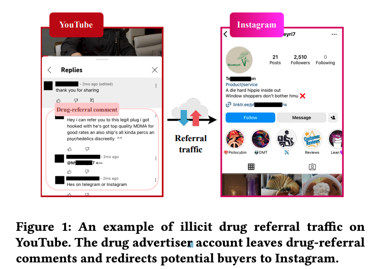
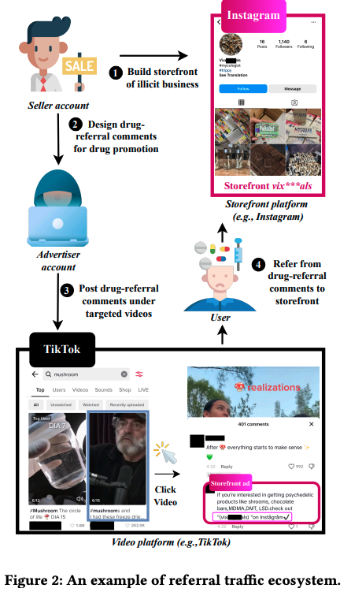
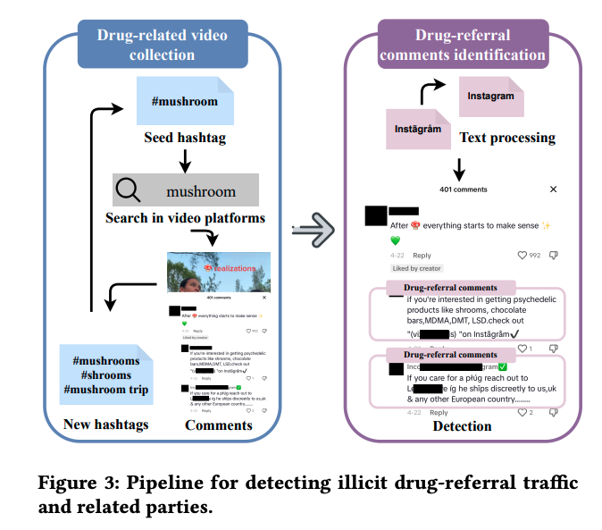

# Understanding Cross-Platform Referral Traffic for Illicit Drug Promotion

**Link:** [https://dl.acm.org/doi/10.1145/3658644.3670383](https://dl.acm.org/doi/10.1145/3658644.3670383)

**Conference:** CCS 2024

**Keywords:** Illicit Drug Promotion, Referral Traffic, Cross-Platform, Social Media

## Summary

The paper presents a study on the referral traffic between different platforms for illicit drug promotion, building an automatic data pipeline to detect the traffic and successfully identifying 154,753 drug promotion referrals and 3,252 vendors. With the data collected, the paper uncover the ecosystem.

## Threat Model
Illicit drug referral traffic (iDRT)

Redirect users from highly popular platforms to platforms with less-restrictive content moderation.

## Detection & Tracking
#### Detection

1. Human collected keywords (snowballing) on Youtube and TikTok. 32,313 drug-related videos (30,660 on Youtube abd 1,653 on TikTok) and 6,307 drug-related keywords with 11,847,301 Youtube comments and 606,276 TikTok comments.

2. Basic text processing for the comments. Consolidate successive comments posted in 5 min.

3. BERT classifier (positive/negative:9000/9000). (note: Cohen’s Kappa coefficient of 0.90). Performance: 99.92% F1.

### Tracking
Apart from self-built website, they primarily use insta (with the abbreviation ig)

Pipeline: detector to get the text -> regex to get vendors' user name and located platform

## Case study & Measurement
qualitative + quantitative + graph analysis