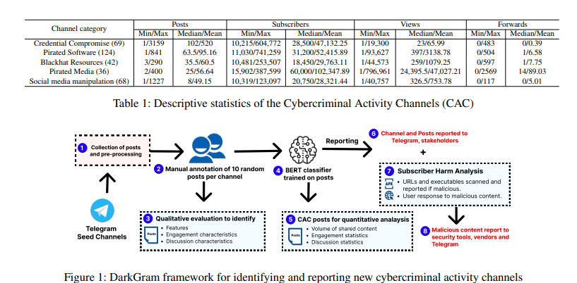

# DarkGram: A Large-Scale Analysis of Cybercriminal Activity Channels on

**Link:** <https://arxiv.org/pdf/2409.14596>

**Conference:** Usenix Security 25

**Keywords:** Cybercrime, telegram, empirical study

**Open source:** <https://github.com/UTA-SPRLab/DarkGram>

## Summary
Develop DarkGram, a BERT-based framework to identify malicious posts from cybercrimial activity channels (CACs). Conduct empirical study on 339 CACs followed by over 23.8M users.

## Contribution
1. Monitoered 339 Telegram channels followed by 23.8M users associated with 5 categories of cybercrimal content: 1) Compromised user credentials, 2) Pirated software, 3) Pirated media, 4) Social media manipulation tools, and 5) Blackhat hacking resources\

2. Developed DarkGram, a BERT-based framework that automatically detects malicious posts with an average accuracy of 96% across the five categories. 

3. Empirical study on user engagement with posts; CAC malicious behaviour to subscribers (The underworld fights against the underworld)

## Data

1. Find popular channels with **Telemetr.io**. Maunally check and find out 339 channels out of 4,709 channels have features in Federal Bureau of Investigation’s Internet Crime Report for 10 most recent posts.

2. Using **Telegram API** collecting 64,801 posts between 21 Feb to 29 May 2024.

3. Label: random select 10 posts from each channel labeled from 2 coders and cohen's kappa is 0.78 (substantial agreement and the disagreements were resolved, a score greater than 0.75 is considered excellent)

## Model
BERT-based, 2 classifers: Cybercriminal Activity (CA) post or not, and detailed cybercrimal categories.

## Empirical Study