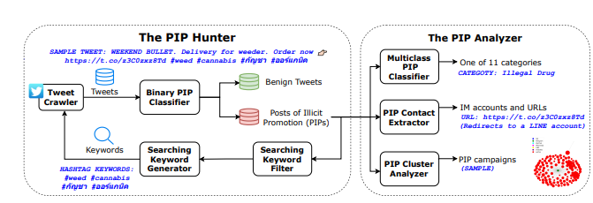

# Detecting and Understanding the Promotion of Illicit Goods and Services on Twitter

**Link:** <https://openreview.net/forum?id=GXxzv80i0O&noteId=B92UdltRzP>

**Webpage:** <https://illicit-promotion.github.io/>

**Conference:** WWW 25

**Keywords:** Cybercrime, telegram, empirical study

**Open source:** <https://github.com/UTA-SPRLab/DarkGram>

## Summary
This paper presents a comprehensive study on the widespread promotion of illicit goods and services on Twitter and other online social networks. It developed machine learning tools to detect and categorize these illicit posts, uncovering a substantial volume across multiple languages and categories like drugs, gambling, and pornography. Their analysis reveals the various evasion tactics employed by these promoters to circumvent content moderation and their preference for direct messaging platforms for customer interaction. Furthermore, the study analyzes the organization of these promotion efforts into campaigns and observes an ongoing "arms race" between these activities and platform moderation. The findings highlight the pervasiveness of this cross-platform issue and offer recommendations for improved detection and mitigation strategies.
