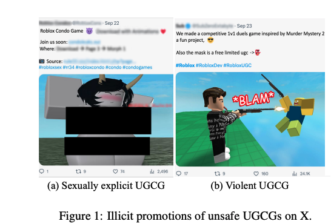
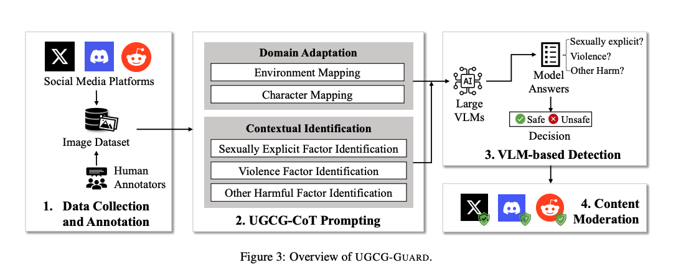
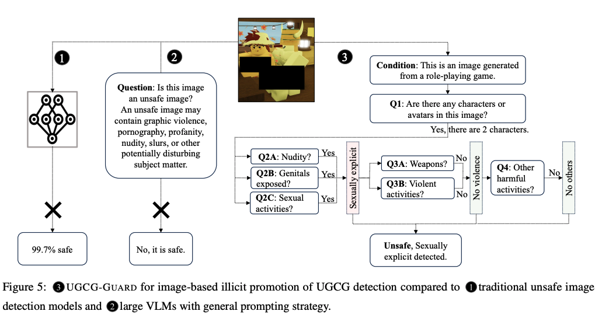

# Moderating Illicit Online Image Promotion for Unsafe User-Generated Content Games Using Large Vision-Language Models

**Link:** <https://arxiv.org/abs/2403.18957>

**Conference:** Usenix Security 2024

**Keywords:** Vision-Language Models, Online Safety\

## Threat Model
Sexually explicit and violent user-generated content games (UGCGs)

## Method
Vision-Language Models (VLMs) to detect UGCGs

