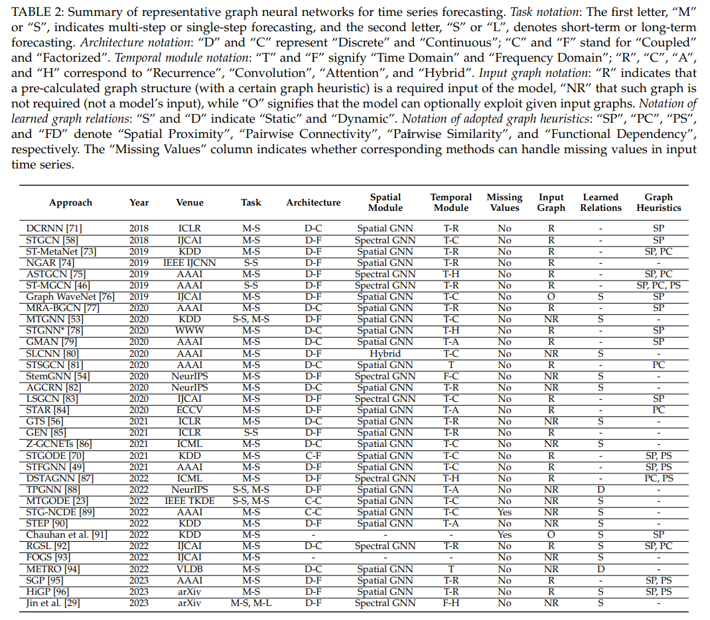

# A Survey on Graph Neural Networks for Time Series: Forecasting, Classification, Imputation, and Anomaly Detection

**Link:**[https://arxiv.org/pdf/2307.03759.pdf](https://arxiv.org/pdf/2307.03759.pdf)

## Abstract
Key con of DL like RNN, CNN, Transformer:  do not explicitly model the spatial relations existing between time series in non-Euclidean space.

GNN can overcome this. 

