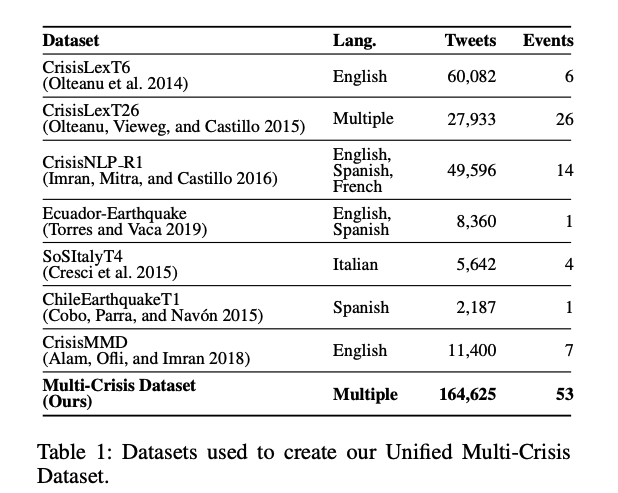
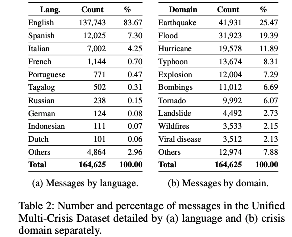

# Combat Greenwashing with GoalSpotter: Automatic Sustainability Objective Detection in Heterogeneous Reports

**Link:** <https://dl.acm.org/doi/10.1145/3627673.3680110>

**Conference:** CIKM 2024 Applied Research Papers

**Keywords:** Greenwashing, Heterogeneous Reports, Text Mining, Transforer

## Summary
Build a clustering-based algorithm to extract text elements of heterogeneous sustainability reports (e.g., pdf, html) and group them into informative text blocks. Then build a transforer-based model to detect sustainability objectives in the text blocks.

## Methodology
1. Discrete textual content processing
Solution: clustering

2. Label 

3. Fine tune Transforer