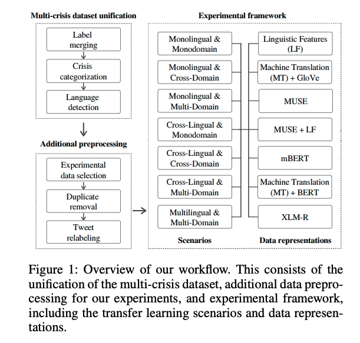
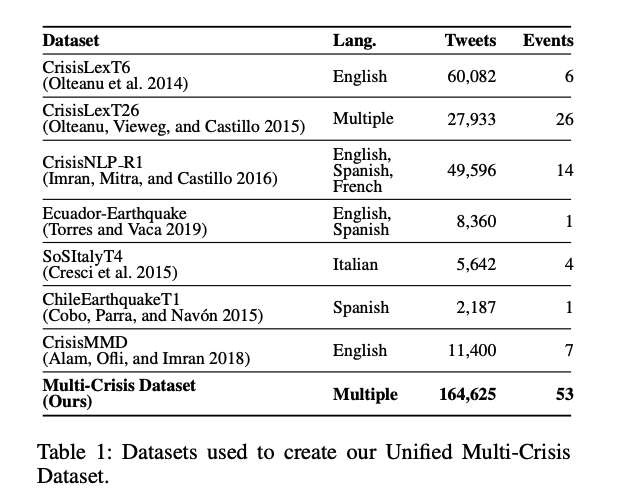
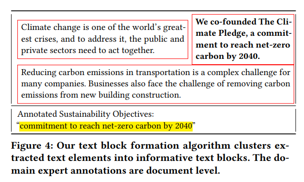

# Cross-Lingual and Cross-Domain Crisis Classification for Low-Resource Scenarios

**Link:** <https://ojs.aaai.org/index.php/ICWSM/article/view/22185/21964>

**Conference:** ICWSM 23

**Keywords:** Crisis Classification, Low-Resource Scenarios, Cross-Lingual, Cross-Domain, Domain Adpation

**Code:** <https://github.com/cinthiasanchez/Crisis-Classification>

## Summary
Twitts can be extracted for useful and timely knowledge for crisis management. However, the lack of labeled data in low-resource scenarios makes it difficult to train a crisis classification model. This paper proposes a cross-lingual and cross-domain crisis classification model for low-resource scenarios. It aims to 1. transfer knowledge from one or more crisis domains (e.g., earthquakes) to other crisis domains and 2)transfer knowledge from crises in one high-resource language to another low-resource language.

## Methodology

Data Representations:
Linguistic Features (LF): [48 features](https://github.com/cinthiasanchez/Crisis-Classification/blob/main/linguistic%20features.md) represented in numerical and binary form

Machine Translation (MT) + GloVe: tokenized and vectorized using the pre-trained GloVe model with 100-dimensions, trained on tweets

Muse: multilingual language-aligned word embeddings of 300-dimensions

Muse + Linguistic Features (MUSE+LF): evaluate if the combination of semantic and statistical features improves model performance

mBERT: model each message using the BERT-Base Multilingual Cased mode

Machine translation (MT) + BERT: similar to MT+GloVe, but using BERT

XLM-RoBerta: multilingual version of RoBERTa trained on 100 languages of CommonCrawl

## [Dataset](https://github.com/cinthiasanchez/Crisis-Classification/blob/main/data/unified/Multi-Crisis%20Dataset%20dir.md)

Systematic label mapping approach for the 7 datasets.
Annotateeach message according to the crisis dimensions of the event that it belongs to.
