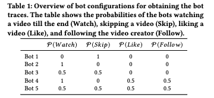

# TikTok and the Art of Personalization: Investigating Exploration and Exploitation on Social Media Feeds

**Link:** <https://dl.acm.org/doi/abs/10.1145/3589334.3645600>

**Conference:** WWW '24

**Keywords:** TikTok, Recommendation Systems, Exploitation

## Summary
Recommendation algorithms for social media feeds often function as black boxes from the perspective of users. This work propose an explanable framework that labels items in the timeline of receiving recommendations and indroduces a set of metrics to capture the extent of personalization across user timelines.

*RQ1:* Given a sequence of content recommendations from a user’s feed, how can we detect which recommendations are the result of personalization?

*RQ2:* How do video engagement factors influence the extent of user personalization on TikTok?

## Data
[Unoffical TikTok API](https://github.com/davidteather/TikTok-Api) to get video with metadata including the video description, the video hashtags, statistics about the video, etc.

4.9m videos viewed 9.2M times by 347 recruited TikTok users. 

Bot: [PlayWright](https://playwright.dev/)

## Social Media Feed Attributes
Content, user, and engagement